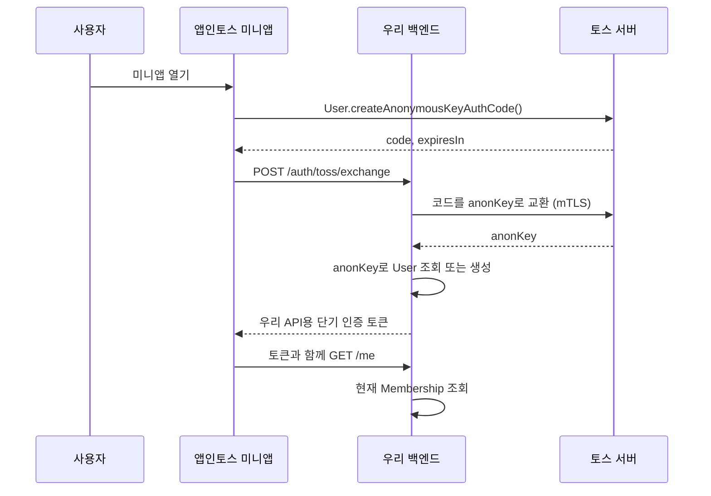

# 미니앱에서 백엔드로 사용자 전달하기

작성일: 2026-09-29, 사용자 식별키 방식으로 개정: 2026-10-02

관련 문서: [제품 기획](./01-product-plan.md) · [API 계약](./03-api-contract.md)

## 선택: 토스 사용자 식별키(anonKey)로 사용자 확인

공동 공간의 물품과 멤버십을 서버에서 보호해야 하므로, 서버가 토스에서 직접 확인한 사용자 식별키로 사용자를 구분한다. 토스 로그인과 달리 로그인 화면이나 약관 동의 화면이 없고, 이름·전화번호·실명 같은 개인정보도 받지 않는다. 토스 로그인은 사업자 등록이 필수이지만 사용자 식별키는 필수 목록에 없어서 사업자 없이 시작할 수 있다.

미니앱이 가진 식별키(`getAnonymousKey`)를 그대로 서버에 보내지 않는다. 클라이언트가 보낸 키는 노출되면 제3자가 같은 사용자처럼 요청할 수 있기 때문이다. 대신 미니앱이 `User.createAnonymousKeyAuthCode()`로 짧게 유효한 일회용 코드를 받고, 우리 서버가 이 코드를 토스에 교환해 `anonKey`를 받는다.

## 바뀌는 값과 고정 사용자 키

| 값 | 수명과 용도 | 우리 DB에서의 취급 |
| --- | --- | --- |
| 인증 `code` | 매 진입에서 새로 받는 일회용 코드(300초 유효) | 교환 후 폐기. 사용자 ID로 저장하지 않음 |
| 토스 `anonKey` | 토스가 해당 미니앱에 부여하는 사용자 식별값. 같은 미니앱에서 같은 사용자는 항상 같은 값이고 기기를 바꿔도 같다 | `User.anonKey`에 유일하게 저장 |
| `User.id` | 우리 서비스 내부 사용자 ID | `Membership` 등 도메인 데이터의 외래키 |
| 우리 API용 단기 인증 토큰 | 우리 API 호출 권한. 앱 진입·만료 시 새로 발급 가능 | 내부 `User.id`를 담아 서명하며, 사용자·가족 관계의 원본 데이터로 저장하지 않음 |

예를 들어 첫 진입에서 `코드 A → anonKey K → User.id U1 → 우리 인증 토큰 A`가 된다. 다음 앱 진입에서는 코드와 토큰이 새 값이어도 `anonKey K`로 다시 `U1`을 찾는다. `Membership`은 `U1`에 연결되어 있으므로 가족 목록은 그대로 남는다. `anonKey`는 미니앱마다 다르므로 다른 미니앱의 키와 섞지 않는다.

백엔드의 사용자 생성은 `anonKey`에 유일 제약을 두고 조회·생성을 원자적으로 처리한다. 모든 가족 API는 우리 인증 토큰에서 `User.id`를 확인한 후 **그때의 `Membership`을 DB에서 조회**한다. 멤버가 추가되거나 나가면 다음 요청에 바로 반영된다. 클라이언트가 보낸 `anonKey`나 `userId`만으로 인증하지 않는다.

## 전달 순서

미니앱은 `code`만 우리 백엔드에 전달한다. 백엔드는 토스 서버와 직접 통신해 `anonKey`를 확인한다. mTLS 인증서·키는 미니앱에 전달하거나 넣지 않는다. 코드는 일회용이므로 실패하면 미니앱에서 새로 받아야 한다. 이 API는 SDK 3.6.0 이상에서 쓸 수 있다.

우리 API는 토스 코드를 매 요청마다 쓰지 않고, 내부 `User.id`와 만료 시각을 담아 서버가 서명한 단기 토큰으로 인증한다. 첫 버전에는 `AuthSession` 테이블이 필요하지 않다. 토큰을 제시해도 요청 본문의 `userId`나 `householdId`만으로 권한을 인정하지 않으며, 현재 `User.status`와 `Membership`을 DB에서 확인한다.

## 이 방식의 한계

- 토스 로그인이 아니라서 이름·전화번호·CI를 받지 못한다. 이 서비스는 필요하지 않다.
- 토스 로그인에 있던 연결 끊기·탈퇴 콜백이 없다. 사용자 비활성화는 운영자가 직접 한다.
- 나중에 토스 로그인을 도입하면 `userKey`는 `anonKey`와 다른 식별자다. 같은 사용자를 이어 붙이려면 별도 연결 절차가 필요하다.

## 초대 링크와 사용자 확인의 관계

초대 토큰은 `누가 어느 공간에 들어갈 수 있는지`를 가리키고, 사용자 식별은 `지금 수락하는 사람이 누구인지`를 확인한다. 두 조건이 모두 충족되어야 `Membership`을 만든다.

1. 초대자가 서버에서 초대를 발급한다.
2. 미니앱이 `intoss://<appName>/invite?token=...` 경로를 토스 공유 링크로 변환해 전달한다.
3. 초대받은 사람이 링크를 열면 미니앱이 사용자 식별키 코드를 받아 서버에 교환한다.
4. 서버가 초대의 만료·취소·남은 횟수와 기존 멤버십을 확인한다.
5. 사용자가 화면에서 `참여하기`를 누르면 서버가 사용 횟수와 멤버십 생성을 한 트랜잭션으로 처리한다.

정식 `intoss://` 공유 링크는 출시 후 접근할 수 있다. 출시 전에는 앱인토스가 발급하는 테스트 스킴과 QR로 경로를 검증한다.

## 백엔드가 먼저 구현할 계약

- `POST /auth/toss/exchange`: 입력 `code`; 출력 우리 API용 단기 인증 토큰과 최소 사용자 정보.
- `GET /me`: 인증 토큰의 `User.id`로 현재 참여 공간을 DB에서 조회.
- 모든 공간 API: 인증 토큰 → `User` → 현재 `Membership` 순서로 접근 검증.
- 초대 수락 API: 인증된 사용자와 유효한 초대 토큰을 원자적으로 결합.

## 공식 근거

- [사용자 식별키 인증 코드 발급](https://developers-apps-in-toss.toss.im/guide/authentication/anonymous-key-auth-code)
- [사용자 식별키 발급](https://developers-apps-in-toss.toss.im/guide/authentication/anon-key)
- [익명 사용자 인증 코드 교환 API](https://developers-apps-in-toss.toss.im/api/user-key)
- [User.createAnonymousKeyAuthCode](https://developers-apps-in-toss.toss.im/documentation/sdk/domains-api/user/user.createanonymouskeyauthcode)
- [미니앱 공유 링크](https://developers-apps-in-toss.toss.im/documentation/common/growth/share/miniapp-share-link)
- [비게임 출시 가이드](https://developers-apps-in-toss.toss.im/checklist/app-nongame)
